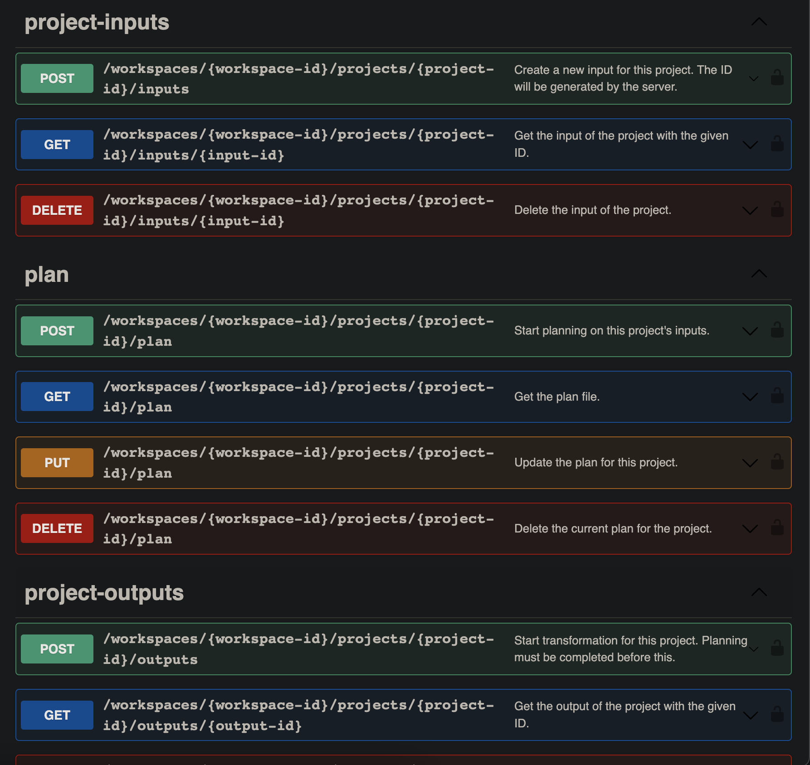

# Move2Kube-API

Move2Kube API provides a REST interface to interact with move2kube [command line tool](https://github.com/konveyor/move2kube).

The API is documented here: https://github.com/konveyor/move2kube-api/blob/main/assets/openapi.json  
(Use https://editor.swagger.io/ to view it.)

## Usage

Run using container from registry using `make crun`

## Setup

1. Obtain a recent version of `golang`. Known to work with `1.19`.
1. Ensure `$GOPATH` is set. If it's not set:
   1. `mkdir ~/go`
   1. `export GOPATH=~/go`
1. Obtain this repo:
   1. `mkdir -p $GOPATH/src/`
   1. Clone this repo into the above directory.
   1. `cd $GOPATH/src/move2kube-api`
1. Build: `make build`
1. Run unit tests: `make test`
1. Run image build: `make cbuild`
1. Run image: `make crun`

## Discussion

* For any questions reach out to us on any of the communication channels given on our website https://move2kube.konveyor.io/
